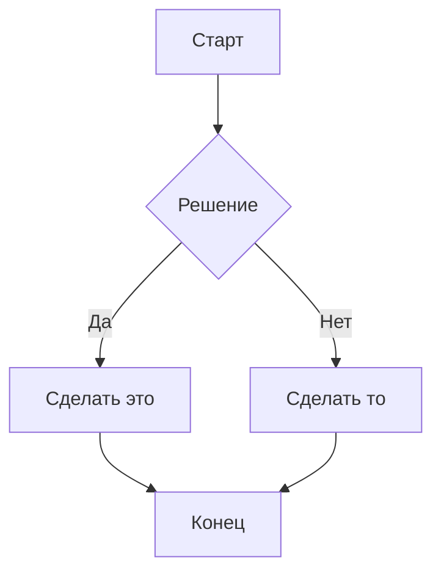

# Руководство по Markdown

Полное справочное руководство по всему, что вы можете писать в Meridian.

---

## Форматирование текста

**Жирный** — `**жирный**`
*Курсив* — `*курсив*`
~~Зачеркнутый~~ — `~~зачеркнутый~~`
==Выделенный== — `==выделенный==`
`Встроенный код` — `` `код` ``

---

## Заголовки

```
# H1 — Название страницы
## H2 — Раздел
### H3 — Подраздел
```

---

## Списки

Маркированный:
- Пункт один
- Пункт два
  - Вложенный пункт

Нумерованный:
1. Первый
2. Второй
3. Третий

---

## Списки задач

- [ ] Задача не выполнена
- [x] Задача завершена
- [ ] Еще одна задача

Чекбоксы задач автоматически собираются на панели [[Задачи и списки]].

---

## Блоки внимания (Callouts)

> [!NOTE]
> Информационный блок.

> [!TIP] Свой заголовок
> Текст после типа блока становится его заголовком.

> [!WARNING]
> Предупреждение о том, на что стоит обратить внимание.

> [!DANGER]
> Критически важная информация или опасность.

> [!SUCCESS]
> Подтверждение или успешное выполнение.

> [!QUESTION]
> Открытые вопросы и темы для исследования.

---

## Блоки кода

```typescript
function greet(name: string): string {
  return `Hello, ${name}!`
}
```

```python
def fibonacci(n: int) -> list[int]:
    a, b = 0, 1
    result = []
    for _ in range(n):
        result.append(a)
        a, b = b, a + b
    return result
```

---

## Таблицы

| Столбец A | Столбец B | Столбец C |
|----------|----------|----------|
| Ячейка 1 | Ячейка 2 | Ячейка 3 |
| Ячейка 4 | Ячейка 5 | Ячейка 6 |

---

## Ссылки

Внешние: [Meridian на GitHub](https://github.com/bvsmma/meridian)

Вики-ссылка: [[Начало работы]]

Вики-ссылка со своим текстом: [[Начало работы|Начать отсюда]]

---

## Диаграммы (Mermaid)



---

## Метаданные (Frontmatter)

```yaml
---
title: Моя заметка
tags: project, research
date: 2026-05-22
---
```

Теги отображаются на панели тегов на боковой панели приложения.
