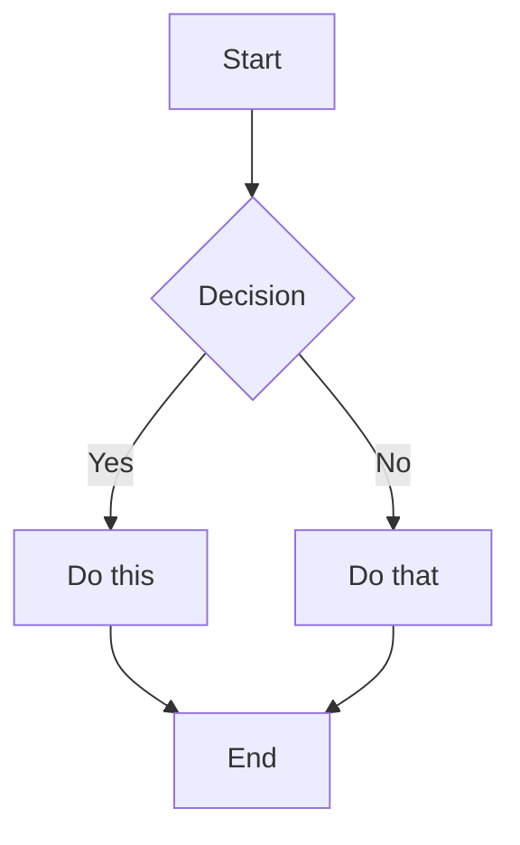

# Markdown Guide

A complete reference for everything you can write in Meridian.

---

## Text formatting

**Bold** — `**bold**`
*Italic* — `*italic*`
~~Strikethrough~~ — `~~strikethrough~~`
==Highlight== — `==highlight==`
`Inline code` — `` `code` ``

---

## Headings

```
# H1 — Page title
## H2 — Section
### H3 — Subsection
```

---

## Lists

Unordered:
- Item one
- Item two
  - Nested item

Ordered:
1. First
2. Second
3. Third

---

## Checklists

- [ ] Task not done
- [x] Task completed
- [ ] Another task

Checklists appear in the [[Tasks & Checklists]] panel.

---

## Callouts

> [!NOTE]
> An informational callout.

> [!TIP] Custom title
> The text after the type becomes the callout heading.

> [!WARNING]
> Something to watch out for.

> [!DANGER]
> Critical information.

> [!SUCCESS]
> Confirmation or success state.

> [!QUESTION]
> Open questions and things to investigate.

---

## Code blocks

```typescript
function greet(name: string): string {
  return `Hello, ${name}!`
}
```

```python
def fibonacci(n: int) -> list[int]:
    a, b = 0, 1
    result = []
    for _ in range(n):
        result.append(a)
        a, b = b, a + b
    return result
```

---

## Tables

| Column A | Column B | Column C |
|----------|----------|----------|
| Cell 1   | Cell 2   | Cell 3   |
| Cell 4   | Cell 5   | Cell 6   |

---

## Links

External: [Meridian on GitHub](https://github.com/bvsmma/meridian)

Wiki-link: [[Getting Started]]

Wiki-link with custom text: [[Getting Started|Start here]]

---

## Diagrams (Mermaid)



---

## Frontmatter

```yaml
---
title: My Note
tags: project, research
date: 2026-05-22
---
```

Tags appear in the Tags panel in the sidebar.
